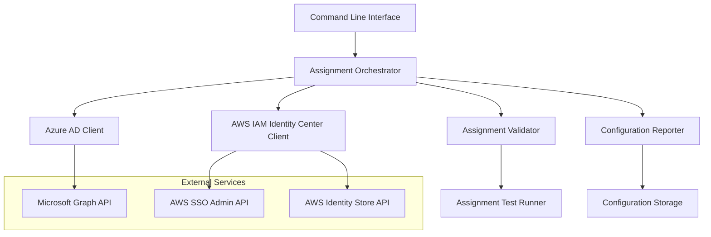

# Design Document: AWS-Azure SSO Group Management Tool

## Overview

This tool provides an automated solution for managing Azure AD security groups within an existing AWS IAM Identity Center integration. The system focuses on discovering Azure AD groups, creating or selecting appropriate AWS permission sets, and establishing group-to-permission assignments across multiple AWS accounts. The design emphasizes automation, validation, and integration with existing organizational workflows.

## Architecture

The system follows a modular architecture with clear separation between Azure AD operations, AWS IAM Identity Center operations, and orchestration logic:



## Components and Interfaces

### Azure AD Client
**Purpose**: Interface with Microsoft Graph API to discover and validate Azure AD security groups.

**Key Operations**:
- List security groups with filtering capabilities
- Retrieve group membership information
- Validate group status and activity
- Check existing group assignments in AWS

**API Dependencies**: Microsoft Graph API v1.0
- `GET /groups` - List security groups
- `GET /groups/{id}/members` - Get group members
- `GET /groups/{id}` - Get group details

### AWS IAM Identity Center Client
**Purpose**: Manage permission sets and group assignments within AWS IAM Identity Center.

**Key Operations**:
- List existing permission sets and their configurations
- Create new permission sets from templates
- Assign groups to permission sets across multiple accounts
- Validate assignment status and functionality

**API Dependencies**:
- AWS SSO Admin API for permission set management
- AWS Identity Store API for group operations
- AWS Organizations API for account enumeration

### Assignment Orchestrator
**Purpose**: Coordinate the end-to-end process of adding Azure AD groups to AWS.

**Key Responsibilities**:
- Workflow management and state tracking
- Error handling and rollback coordination
- Bulk operation processing
- Integration with approval workflows

### Assignment Validator
**Purpose**: Test and validate that group assignments work correctly.

**Validation Types**:
- Group synchronization verification
- Permission inheritance testing
- Access validation through test operations
- Conflict detection and resolution

### Configuration Reporter
**Purpose**: Generate reports, documentation, and maintain assignment history.

**Reporting Capabilities**:
- Current assignment summaries
- Change history tracking
- Compliance and audit reports
- Configuration export/import

## Data Models

### Azure Group Model
```typescript
interface AzureGroup {
  id: string;
  displayName: string;
  description?: string;
  groupType: 'Security' | 'Distribution' | 'Microsoft365';
  memberCount: number;
  isAssignedToAWS: boolean;
  lastSyncTime?: Date;
}
```

### AWS Permission Set Model
```typescript
interface PermissionSet {
  arn: string;
  name: string;
  description?: string;
  sessionDuration: string;
  managedPolicies: string[];
  inlinePolicy?: string;
  tags: Record<string, string>;
  accountAssignments: AccountAssignment[];
}
```

### Group Assignment Model
```typescript
interface GroupAssignment {
  azureGroupId: string;
  azureGroupName: string;
  awsAccountId: string;
  permissionSetArn: string;
  assignmentStatus: 'PENDING' | 'ACTIVE' | 'FAILED';
  createdDate: Date;
  lastValidated?: Date;
}
```

### Assignment Operation Model
```typescript
interface AssignmentOperation {
  operationId: string;
  operationType: 'CREATE' | 'DELETE' | 'UPDATE';
  assignments: GroupAssignment[];
  status: 'IN_PROGRESS' | 'COMPLETED' | 'FAILED' | 'ROLLED_BACK';
  errors: OperationError[];
  startTime: Date;
  endTime?: Date;
}
```
## Correctness Properties

*A property is a characteristic or behavior that should hold true across all valid executions of a system—essentially, a formal statement about what the system should do. Properties serve as the bridge between human-readable specifications and machine-verifiable correctness guarantees.*

### Property 1: Azure Group Discovery Accuracy
*For any* Azure AD tenant with security groups, when the tool retrieves groups, all returned groups should be valid security groups that exist in the tenant and match any applied filters.
**Validates: Requirements 1.1**

### Property 2: Assignment Conflict Detection
*For any* set of existing group assignments and new assignment requests, the tool should correctly identify all conflicts where the same group would be assigned to the same account with different permission sets.
**Validates: Requirements 3.2**

### Property 3: Group Validation Completeness
*For any* Azure AD group, the tool should correctly determine whether the group is active, has members, and is suitable for AWS assignment based on the group's current state.
**Validates: Requirements 1.3**

### Property 4: Permission Set Template Validity
*For any* permission set template provided by the tool, the template should contain valid AWS IAM policies and be deployable to AWS IAM Identity Center without errors.
**Validates: Requirements 2.3**

### Property 5: Bulk Operation Consistency
*For any* bulk assignment operation involving multiple groups and accounts, either all assignments should succeed or the system should provide accurate status for each individual assignment.
**Validates: Requirements 6.1, 6.3**

### Property 6: Assignment Status Verification
*For any* completed group assignment, when the tool validates the assignment, it should correctly report whether the group members appear in AWS IAM Identity Center and have the expected permissions.
**Validates: Requirements 4.1, 4.3**

### Property 7: Configuration Export Round-trip
*For any* valid system configuration, exporting the configuration and then importing it should result in an equivalent configuration state.
**Validates: Requirements 5.4**

### Property 8: Error Message Specificity
*For any* error condition during group assignment operations, the tool should provide error messages that include specific details about what failed and actionable remediation steps.
**Validates: Requirements 7.1, 4.4**

### Property 9: Rollback Completeness
*For any* set of group assignments that are rolled back, the system should return to the exact state that existed before those assignments were made.
**Validates: Requirements 7.3**

### Property 10: Audit Trail Completeness
*For any* operation performed by the tool, all changes to group assignments, permission sets, and configurations should be recorded in the audit log with sufficient detail for compliance and troubleshooting.
**Validates: Requirements 5.2, 8.3**

## Error Handling

The system implements comprehensive error handling across all integration points:

### Azure AD Integration Errors
- **Authentication Failures**: Retry with exponential backoff, clear error messages for credential issues
- **API Rate Limiting**: Implement throttling and queue management for bulk operations
- **Group Not Found**: Validate group existence before attempting operations
- **Permission Denied**: Clear guidance on required Azure AD permissions

### AWS IAM Identity Center Errors
- **Permission Set Creation Failures**: Validate policies before creation, provide specific policy error details
- **Assignment Conflicts**: Detect and report existing assignments, suggest resolution strategies
- **Account Access Issues**: Validate account permissions and organization membership
- **API Throttling**: Implement retry logic with appropriate delays

### Data Consistency Errors
- **Synchronization Delays**: Account for eventual consistency in both Azure AD and AWS
- **Partial Failures**: Track individual operation status in bulk operations
- **State Conflicts**: Detect when external changes conflict with tool operations

### Recovery Mechanisms
- **Automatic Retry**: For transient failures with exponential backoff
- **Manual Intervention Points**: Clear breakpoints where user input is required
- **Rollback Capabilities**: Ability to undo operations that fail partway through
- **State Validation**: Regular checks to ensure system state matches expectations

## Testing Strategy

The testing approach combines unit testing for individual components with property-based testing for system-wide correctness guarantees.

### Unit Testing Focus Areas
- **API Integration Points**: Mock external services to test error handling and data parsing
- **Data Transformation Logic**: Verify correct mapping between Azure AD and AWS data models
- **Validation Functions**: Test edge cases for group validation, conflict detection, and permission verification
- **Configuration Management**: Test export/import functionality with various configuration scenarios

### Property-Based Testing Configuration
- **Testing Framework**: Use Hypothesis (Python) or fast-check (TypeScript) for property-based tests
- **Test Iterations**: Minimum 100 iterations per property test to ensure comprehensive coverage
- **Data Generators**: Create realistic test data generators for Azure groups, AWS accounts, and permission sets
- **Property Test Tags**: Each test tagged with format: **Feature: aws-azure-sso-setup, Property {number}: {property_text}**

### Integration Testing
- **End-to-End Workflows**: Test complete group addition workflows with mocked external services
- **Error Scenario Testing**: Simulate various failure conditions to verify error handling
- **Performance Testing**: Validate bulk operation performance with large datasets
- **Security Testing**: Verify that sensitive data (credentials, tokens) is handled securely

### Test Data Management
- **Synthetic Data Generation**: Create realistic but synthetic Azure AD and AWS data for testing
- **Test Environment Isolation**: Ensure tests don't interfere with production systems
- **Data Cleanup**: Automatic cleanup of test data after test execution
- **Reproducible Scenarios**: Ability to recreate specific test scenarios for debugging
