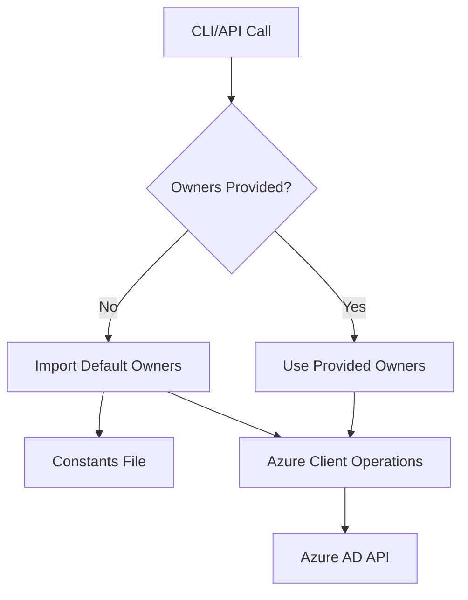

# Design Document: Default Azure Owner Emails

## Overview

This design implements a simple mechanism to provide default owner emails for Azure AD operations through a constants file. When Azure operations require owner emails but none are explicitly provided, the system will use predefined default values from `src/constants/default-owners.ts`.

## Architecture

The solution follows a straightforward approach:

1. **Constants File**: A simple TypeScript file exports an array of default owner email addresses
2. **Azure Client Enhancement**: The existing `AzureClient` class is enhanced to use default owners when none are provided
3. **Backward Compatibility**: All existing functionality remains unchanged when explicit owners are provided



## Components and Interfaces

### Constants File Structure

**File Location**: `src/constants/default-owners.ts`

```typescript
// Default owner email addresses for Azure AD operations
export const DEFAULT_OWNER_EMAILS: string[] = [
    'admin@company.com',
    'azure-admin@company.com'
];
```

### Azure Client Enhancement

The `AzureClient` class will be enhanced with a helper method to resolve owner emails:

```typescript
/**
 * Resolve owner emails by using provided emails or falling back to defaults
 */
private resolveOwnerEmails(providedOwners?: string[]): string[] {
    if (providedOwners && providedOwners.length > 0) {
        return providedOwners;
    }
    return DEFAULT_OWNER_EMAILS;
}
```

### Modified Methods

The following existing methods will be updated to use the resolver:

1. `addGroupOwner()` - When called without explicit owner
2. `createSecurityGroup()` - Enhanced to accept optional owners parameter
3. Any other methods that work with group ownership

## Data Models

No new data models are required. The existing email validation and user validation logic will be reused for default owner emails.

## Error Handling

The system will handle errors gracefully:

1. **Missing Constants File**: If the constants file cannot be imported, the system will throw a clear error during startup
2. **Empty Default Owners**: If the default owners array is empty, operations requiring owners will fail with a descriptive error
3. **Invalid Default Emails**: Default owner emails will be validated using existing email validation logic

## Testing Strategy

### Unit Testing Approach

The implementation will use unit tests to verify correct behavior:

**Unit Tests**:
- Verify constants file structure and exports
- Test specific scenarios with known inputs
- Test error conditions (missing file, invalid emails)
- Test owner resolution with and without provided owners
- Test all affected Azure operations

### Test Coverage

1. **Constants File Tests**:
   - Verify file exists and exports correct structure
   - Validate default email formats

2. **Azure Client Integration Tests**:
   - Test owner resolution with and without provided owners
   - Test all affected Azure operations
   - Verify backward compatibility with existing functionality
